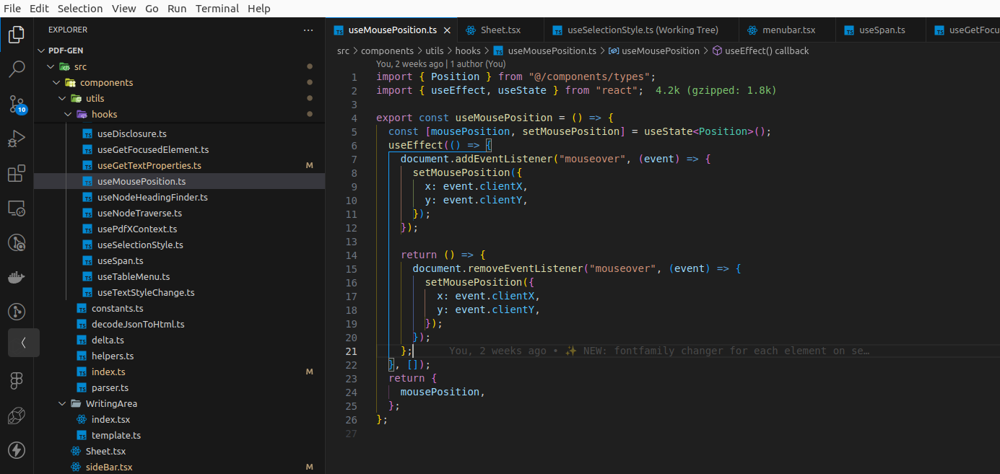

# ChromaPalette Dark - Visual Studio Code Color Theme

## Preview



ChromaPalette Dark is a sleek and elegant color theme for Visual Studio Code's dark mode. It provides a soothing and comfortable coding environment with a balanced combination of dark tones and vibrant accents.

## Installation

1. Launch Visual Studio Code.
2. Open the **Extensions** view by clicking on the square icon in the sidebar on the left or by pressing `Ctrl+Shift+X`.
3. Search for **ChromaPalette Dark** in the Extensions view search bar.
4. Click on the **Install** button for the theme that is provided by the **Assistant**.
5. Once the installation is complete, click on the **Reload** button to activate the theme.

## Activation

To activate the ChromaPalette Dark color theme:

1. Click on the **File** menu.
2. Select **Preferences**.
3. Choose **Color Theme**.
4. From the dropdown, select **ChromaPalette Dark**.

## Customization

If you want to make any customizations to the theme, you can do so by modifying the `settings.json` file in Visual Studio Code. Here's an example of how you can customize the theme:

```json
{
	"workbench.colorCustomizations": {
		"[ChromaPalette Dark]": {
			"editor.background": "#1E2127",
			"editor.foreground": "#ABB2BF",
			// Add more customizations here
		}
	}
}
```

Feel free to adjust the colors and settings according to your preference.

## Feedback

If you have any suggestions, feedback, or issues related to the ChromaPalette Dark color theme, please don't hesitate to [open an issue](https://github.com/Humed-Muhammad/ChromaPalette/issues) on the GitHub repository.

Enjoy coding with ChromaPalette Dark!